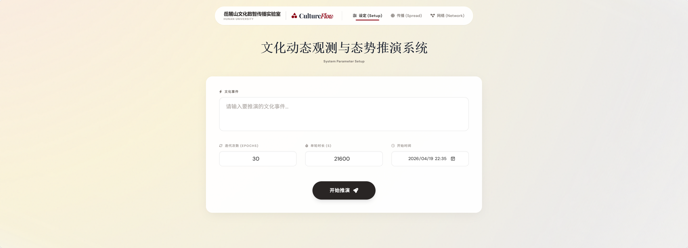
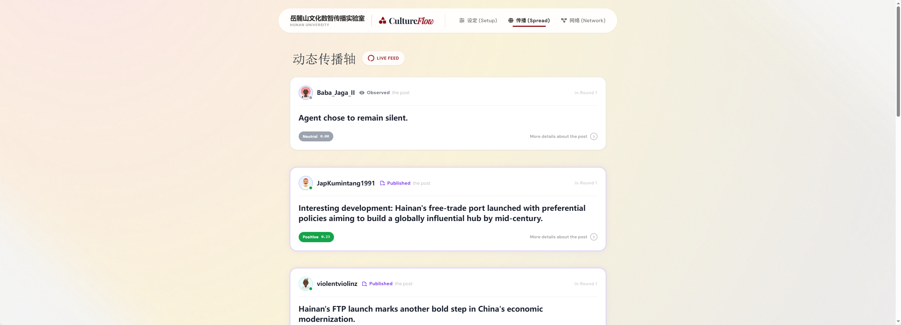
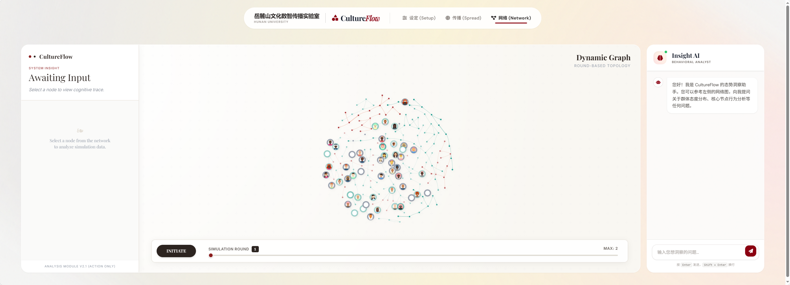

# Culture_flow_Sim: A system for simulating cultural dynamics

Culture_flow_Sim conducts simulations involving multiple cultural key opinion leaders and ordinary users on social media, thereby simulating the process of cultural dissemination within social networks.

| 参数设置 | 推演过程 |
| --- | --- |
|  |  |


## Getting Started
### Installation
```bash
conda create -n Culture_flow_Sim python=3.9
conda activate Culture_flow_Sim
git clone https://github.com/mmmmmxy/Culture_flow_Sim.git
cd Culture_flow_Sim
pip install requirements.txt
```

### Environment Variables
You need to export your OpenAI API key as follows：
```bash
# Export your OpenAI API key
export OPENAI_API_BASE="your_api_base_here"
export OPENAI_API_KEY="your_api_key_here"
```

### Simulation
#### Framework Required Modules
```
- agentverse 
  - agents
    - simulation_agent
      - twitter
  - environments
    - simulation_env
      - twitter
  - abm_model
  - twitter_page
  - info_box
  - message
```

#### Cultural Trend Analysis
Use the following command to open the deduction system
```shell
python start.py
```
After running the above command, access localhost:5000 to enter the system.


